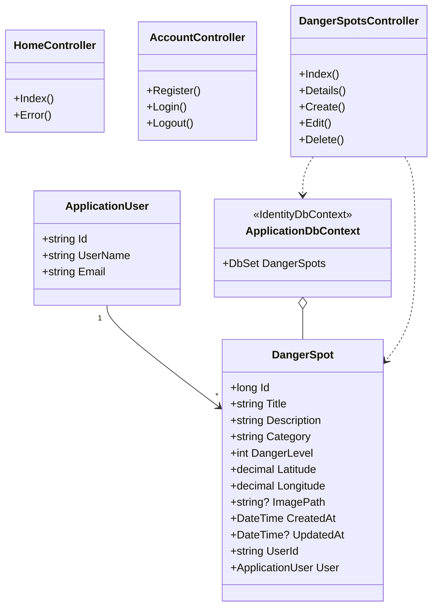
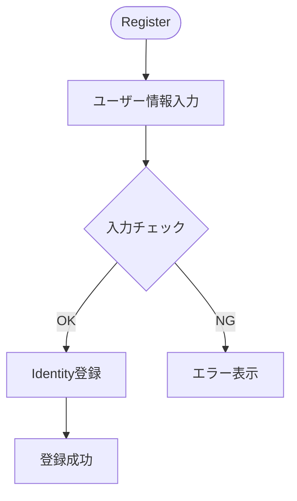
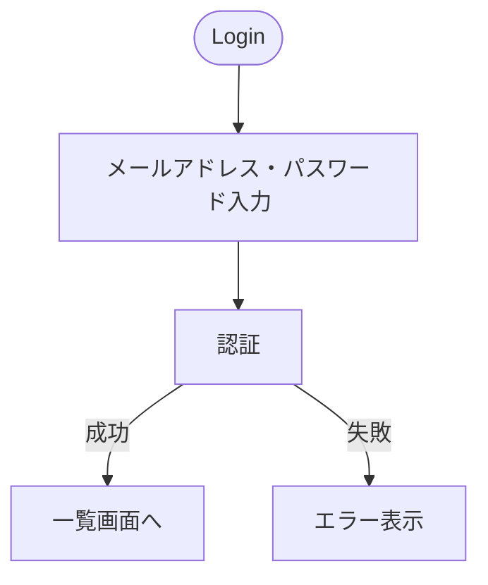
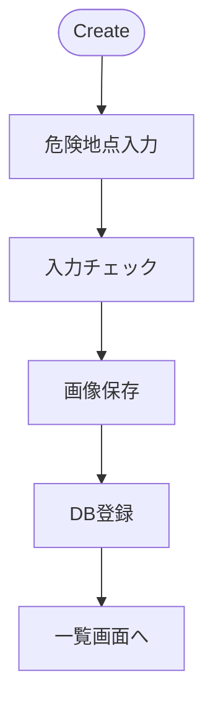
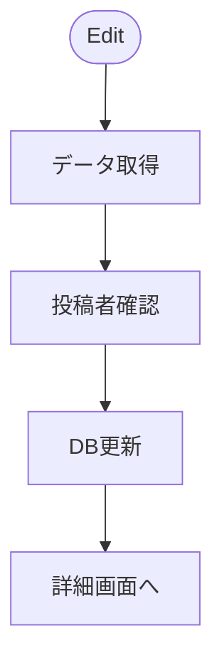
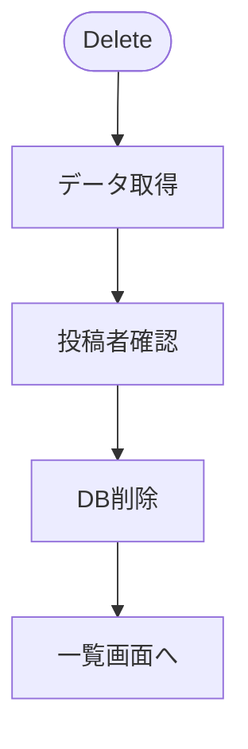
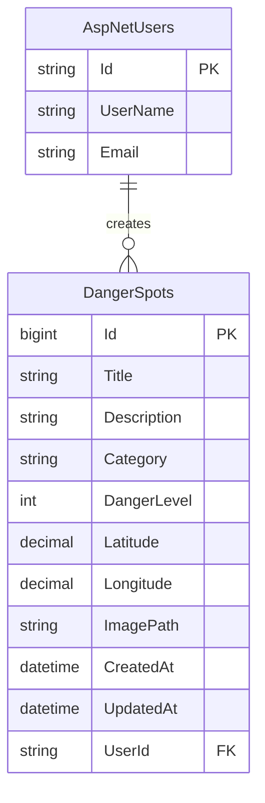

# SafeWalk VNJP 内部設計書（ドラフト）

| 項目      | 内容                           |
| ------- | ---------------------------- |
| プロジェクト名 | SafeWalk VNJP（歩行者危険情報共有システム） |
| バージョン   | 0.1（ドラフト）                    |
| 作成日     | 2026-05-28                   |
| ステータス   | レビュー前                        |

> 本書は要件定義書および外部設計書を踏まえ、内部実装の構造（クラス図 / 処理フロー / ER図 / テーブル定義）を整理した内部設計書のドラフトである。

---

## 1. クラス図

### 1.1 モデル / DbContext / コントローラ全体図



### 1.2 クラスの責務

| クラス                     | 種類           | 責務                             |
| ----------------------- | ------------ | ------------------------------ |
| `ApplicationUser`       | Identityユーザー | ASP.NET Core Identityのユーザー情報管理 |
| `DangerSpot`            | エンティティ       | 危険地点情報を管理                      |
| `ApplicationDbContext`  | DbContext    | EF CoreによるDBアクセス               |
| `HomeController`        | コントローラ       | トップ画面・エラー画面                    |
| `AccountController`     | コントローラ       | ユーザー登録・ログイン・ログアウト              |
| `DangerSpotsController` | コントローラ       | 危険地点のCRUD処理                    |

---

## 2. 処理フロー

### 2.1 ユーザー登録



### 2.2 ログイン



### 2.3 危険地点投稿



### 2.4 危険地点編集



### 2.5 危険地点削除



---

## 3. テーブル定義書

### 3.1 ER図



### 3.2 テーブル定義

#### 3.2.1 AspNetUsers

Identity標準テーブルを利用する。

| カラム          | 型    | 説明        |
| ------------ | ---- | --------- |
| Id           | text | 主キー       |
| UserName     | text | ユーザー名     |
| Email        | text | メールアドレス   |
| PasswordHash | text | パスワードハッシュ |

---

#### 3.2.2 DangerSpots

| カラム         | 型             | NULL | 説明     |
| ----------- | ------------- | ---- | ------ |
| Id          | bigint        | ×    | 主キー    |
| Title       | varchar(100)  | ×    | 危険地点名  |
| Description | text          | ×    | 危険内容   |
| Category    | varchar(50)   | ×    | 危険カテゴリ |
| DangerLevel | int           | ×    | 危険レベル  |
| Latitude    | decimal(10,7) | ×    | 緯度     |
| Longitude   | decimal(10,7) | ×    | 経度     |
| ImagePath   | varchar(255)  | ○    | 画像パス   |
| CreatedAt   | timestamp     | ×    | 登録日時   |
| UpdatedAt   | timestamp     | ○    | 更新日時   |
| UserId      | text          | ×    | 投稿者    |

* 主キー

  * Id

* インデックス

  * IX_DangerSpots_UserId
  * IX_DangerSpots_Category

* 外部キー

  * UserId → AspNetUsers.Id

---

## 4. バリデーション仕様

### 4.1 ユーザー登録

| 項目      | 条件       |
| ------- | -------- |
| ユーザー名   | 必須       |
| メールアドレス | 必須、メール形式 |
| パスワード   | 必須、8文字以上 |

### 4.2 危険地点投稿

| 項目    | 条件          |
| ----- | ----------- |
| タイトル  | 必須、100文字以内  |
| 危険内容  | 必須、1000文字以内 |
| カテゴリ  | 必須          |
| 危険レベル | 1～5         |
| 緯度    | -90～90      |
| 経度    | -180～180    |
| 写真    | JPG、PNG     |

---

## 5. 権限制御仕様

### 5.1 権限一覧

| 操作     | 権限       |
| ------ | -------- |
| 危険地点一覧 | ログインユーザー |
| 危険地点詳細 | ログインユーザー |
| 危険地点投稿 | ログインユーザー |
| 危険地点編集 | 投稿者本人    |
| 危険地点削除 | 投稿者本人    |

### 5.2 編集処理

```text
ログインユーザー取得
 ↓
DangerSpot取得
 ↓
DangerSpot.UserId == CurrentUser.Id
 ↓
一致
 ↓
編集許可

不一致
 ↓
403 Forbidden
```

### 5.3 削除処理

```text
ログインユーザー取得
 ↓
DangerSpot取得
 ↓
DangerSpot.UserId == CurrentUser.Id
 ↓
一致
 ↓
削除許可

不一致
 ↓
403 Forbidden
```

---

## 6. ファイルアップロード仕様

### 保存先

```text
wwwroot/uploads
```

### 許可形式

```text
jpg
jpeg
png
```

### 最大サイズ

```text
5MB
```

### 保存方式

```text
GUIDを利用した一意のファイル名で保存
```

---

## 7. 地図表示仕様

| 項目      | 内容            |
| ------- | ------------- |
| 地図ライブラリ | Leaflet       |
| 地図データ   | OpenStreetMap |
| マーカー表示  | 危険地点ごとに表示     |
| ポップアップ  | タイトル・危険レベル表示  |
| 詳細遷移    | 詳細画面へ遷移       |
| 投稿補助    | 地図クリックで緯度経度取得 |

---

## 8. 危険カテゴリ

| 値            | 内容       |
| ------------ | -------- |
| Crossing     | 横断困難     |
| NoSidewalk   | 歩道未整備    |
| HeavyTraffic | バイク交通量過多 |
| Flood        | 冠水エリア    |
| NightRisk    | 夜間危険     |
| Construction | 工事中      |
| NoSignal     | 信号機なし    |

---

## 9. 危険レベル

| レベル | 内容     |
| --- | ------ |
| 1   | 軽微     |
| 2   | 注意     |
| 3   | 危険     |
| 4   | 非常に危険  |
| 5   | 通行回避推奨 |

---

## 改訂履歴

| 改定日        | バージョン | 改訂者 | 改定箇所 | 改定内容                               |
| ---------- | ----- | --- | ---- | ---------------------------------- |
| 2026-05-28 | 0.1   | 担当者 | -    | 初版作成                               |
| 2026-05-28 | 0.2   | 担当者 | 全体   | クラス図・バリデーション・権限制御・地図仕様・アップロード仕様を追加 |
