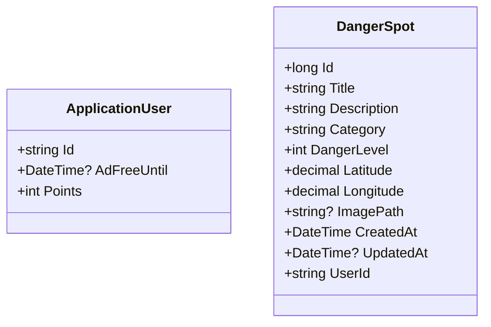
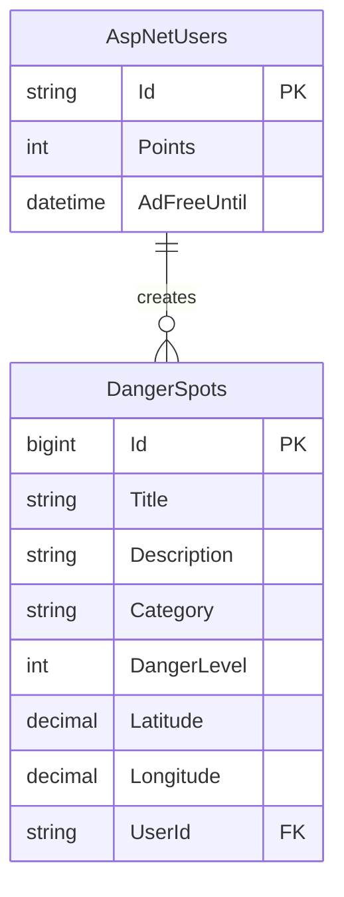

# SafeWalk VNJP 内部設計書

| 項目      | 内容                           |
| ------- | ---------------------------- |
| プロジェクト名 | SafeWalk VNJP（歩行者危険情報共有システム） |
| バージョン   | 1.0                    |
| 作成日     | 2026-06-04                   |
| ステータス   | 運用中                        |

---

## 1. クラス図

### 1.1 モデル

---

## 2. テーブル定義書

### 2.1 ER図

### 2.2 テーブル定義（主要追加カラムのみ）

#### 2.2.1 AspNetUsers

| カラム          | 型    | 説明        |
| ------------ | ---- | --------- |
| Points       | int  | ユーザーポイント  |
| AdFreeUntil  | datetime | 広告非表示期限  |

#### 2.2.2 DangerSpots

| カラム         | 型             | NULL | 説明     |
| ----------- | ------------- | ---- | ------ |
| (既存カラム)    | -             | -    | -      |

---

## 改訂履歴

| 改定日        | バージョン | 改訂者 | 改定内容                               |
| ---------- | ----- | --- | ---- | ---------------------------------- |
| 2026-05-28 | 0.1   | 担当者 | 初版作成                               |
| 2026-06-04 | 1.0   | 担当者 | ポイント・広告非表示機能追加に伴うモデル修正 |
