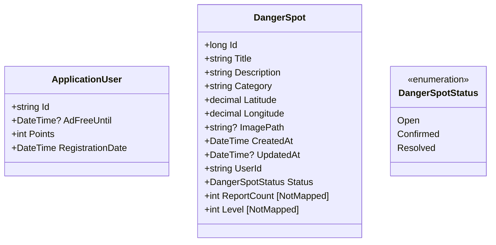
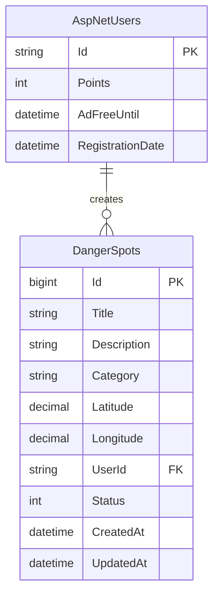

# SafeWalk VNJP 内部設計書

| 項目      | 内容                           |
| ------- | ---------------------------- |
| プロジェクト名 | SafeWalk VNJP（歩行者危険情報共有システム） |
| バージョン   | 1.2                    |
| 作成日     | 2026-06-09                   |
| ステータス   | 運用中                        |

---

## 1. クラス図

### 1.1 モデル

---

## 2. テーブル定義書

### 2.1 ER図

### 2.2 テーブル定義（主要追加カラムのみ）

#### 2.2.1 AspNetUsers

| カラム          | 型    | 説明        |
| ------------ | ---- | --------- |
| Points       | int  | ユーザーポイント  |
| AdFreeUntil  | datetime | 広告非表示期限  |
| RegistrationDate | datetime | ユーザー登録日 |

#### 2.2.2 DangerSpots

| カラム         | 型             | NULL | 説明     |
| ----------- | ------------- | ---- | ------ |
| Status      | int           | No   | 0:Open, 1:Confirmed, 2:Resolved |
| CreatedAt   | datetime      | No   | 投稿日時 |
| UpdatedAt   | datetime      | Yes  | 更新日時 |

---

## 3. ロジック設計

### 3.1 近接地点判定（DangerSpotsController）

同一地点の定義として、緯度（Latitude）および経度（Longitude）を小数点第4位で四捨五入（`Math.Round(val, 4)`）した値をキーとする。
これにより、半径約11m以内の投稿を同一地点として集計し、`ReportCount`にセットする。

### 3.2 危険レベル算出（DangerLevelHelper）

投稿されたカテゴリ（カンマ区切り文字列）を分解し、以下の重みに基づきスコアを合算する。

| カテゴリ | スコア |
| --- | --- |
| Flood (冠水) | 3 |
| Crossing (横断歩道なし等) | 2 |
| HeavyTraffic (交通量多) | 2 |
| NightRisk (夜間危険) | 2 |
| NoSignal (信号なし) | 2 |
| NoSidewalk (歩道なし) | 1 |
| Construction (工事中) | 1 |

合算されたスコアを以下の閾値でレベル（1～5）に変換する。
- 1以下: 1 (軽微)
- 2: 2 (注意)
- 3: 3 (危険)
- 4～5: 4 (非常に危険)
- 6以上: 5 (回避推奨)

---

## 改訂履歴

| 改定日        | バージョン | 改訂者 | 改訂内容                               |
| ---------- | ----- | --- | ---- | ---------------------------------- |
| 2026-05-28 | 0.1   | 担当者 | 初版作成                               |
| 2026-06-04 | 1.0   | 担当者 | ポイント・広告非表示機能追加に伴うモデル修正 |
| 2026-06-09 | 1.1   | 担当者 | ステータス管理、登録日追加に伴うモデル・ER図の修正 |
| 2026-06-09 | 1.2   | 担当者 | 非マッピング属性の追記、近接判定・レベル算出ロジックの追加 |
