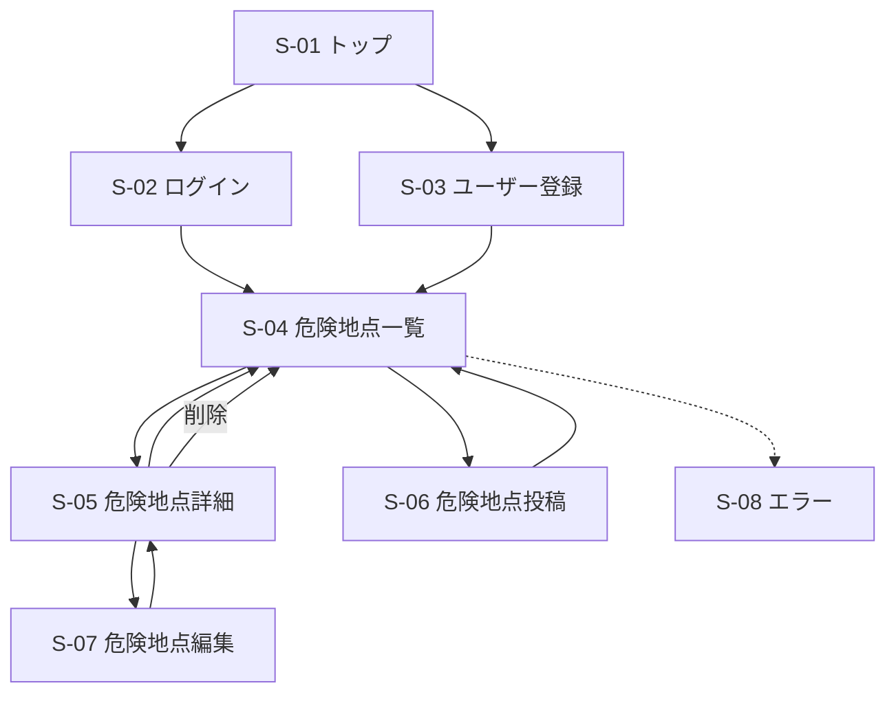

# SafeWalk VNJP 外部設計書（ドラフト）

| 項目      | 内容                           |
| ------- | ---------------------------- |
| プロジェクト名 | SafeWalk VNJP（歩行者危険情報共有システム） |
| バージョン   | 0.1（ドラフト）                    |
| 作成日     | 2026-05-28                   |
| ステータス   | レビュー前                        |

> 本書は要件定義書を踏まえ、利用者から見える画面・機能・画面遷移を整理した外部設計書のドラフトである。

---

## 1. 画面一覧

### 1.1 画面（GETでビューを返すもの）

| ID   | 画面名    | URL                         | コントローラ.アクション                    | 認証 | 概要             |
| ---- | ------ | --------------------------- | ------------------------------- | -- | -------------- |
| S-01 | トップ    | `/`                         | `HomeController.Index`          | 不要 | システム紹介画面       |
| S-02 | ログイン   | `/Account/Login`            | `AccountController.Login`       | 不要 | メール・パスワードでログイン |
| S-03 | ユーザー登録 | `/Account/Register`         | `AccountController.Register`    | 不要 | ユーザー新規登録       |
| S-04 | 危険地点一覧 | `/DangerSpots`              | `DangerSpotsController.Index`   | 要  | 危険地点一覧表示       |
| S-05 | 危険地点詳細 | `/DangerSpots/Details/{id}` | `DangerSpotsController.Details` | 要  | 危険地点詳細表示       |
| S-06 | 危険地点投稿 | `/DangerSpots/Create`       | `DangerSpotsController.Create`  | 要  | 危険地点登録         |
| S-07 | 危険地点編集 | `/DangerSpots/Edit/{id}`    | `DangerSpotsController.Edit`    | 要  | 危険地点編集         |
| S-08 | エラー    | `/Home/Error`               | `HomeController.Error`          | 不要 | エラー画面          |

### 1.2 画面を持たないPOSTアクション

| アクション  | URL                             | トリガー | 概要     |
| ------ | ------------------------------- | ---- | ------ |
| ログアウト  | `POST /Account/Logout`          | ナビバー | ログアウト  |
| 危険地点削除 | `POST /DangerSpots/Delete/{id}` | 詳細画面 | 危険地点削除 |

---

## 2. 画面遷移図

---

## 3. 各画面ワイヤーフレーム概要

### S-01 トップ

* アプリ紹介
* ログインボタン
* 新規登録ボタン

---

### S-02 ログイン

入力項目

* メールアドレス
* パスワード

アクション

* ログイン
* 新規登録へ

---

### S-03 ユーザー登録

入力項目

* ユーザー名
* メールアドレス
* パスワード

アクション

* 登録

---

### S-04 危険地点一覧

表示項目

* 危険地点名
* カテゴリ
* 危険レベル
* 登録日時

機能

* カテゴリ絞り込み
* 危険レベル絞り込み
* 地図表示
* 新規投稿

---

### S-05 危険地点詳細

表示項目

* 危険地点名
* 危険内容
* カテゴリ
* 危険レベル
* 位置情報
* 写真
* GoogleMapリンク

アクション

* 編集
* 削除
* 一覧へ戻る

---

### S-06 危険地点投稿

入力項目

* タイトル
* 危険内容
* カテゴリ
* 危険レベル（1〜5）
* 緯度
* 経度
* 写真

アクション

* 登録
* キャンセル

---

### S-07 危険地点編集

入力項目

* タイトル
* 危険内容
* カテゴリ
* 危険レベル
* 緯度
* 経度
* 写真

アクション

* 保存
* キャンセル

---

### S-08 エラー

表示項目

* エラーメッセージ
* トップへ戻るリンク

---

## 4. 機能一覧

### 4.1 機能要件

| ID   | 機能名      | 関連画面 | 概要          | 認証 | 権限       |
| ---- | -------- | ---- | ----------- | -- | -------- |
| F-01 | ユーザー登録   | S-03 | 新規ユーザー登録    | 不要 | -        |
| F-02 | ログイン     | S-02 | Cookie認証    | 不要 | -        |
| F-03 | ログアウト    | 全画面  | ログアウト処理     | 要  | -        |
| F-04 | 危険地点一覧   | S-04 | 危険地点一覧表示    | 要  | 全ユーザー    |
| F-05 | 危険地点詳細   | S-05 | 危険地点詳細表示    | 要  | 全ユーザー    |
| F-06 | 危険地点投稿   | S-06 | 危険地点登録      | 要  | ログインユーザー |
| F-07 | 危険地点編集   | S-07 | 危険地点編集      | 要  | 投稿者      |
| F-08 | 危険地点削除   | S-05 | 危険地点削除      | 要  | 投稿者      |
| F-09 | カテゴリ絞り込み | S-04 | カテゴリ検索      | 要  | 全ユーザー    |
| F-10 | 地図表示     | S-04 | GoogleMap表示 | 要  | 全ユーザー    |

---

### 4.2 危険カテゴリ一覧

* 横断困難
* 歩道未整備
* バイク交通量過多
* 冠水エリア
* 夜間危険
* 工事中
* 信号機なし

---

### 4.3 権限ルール

| 操作     | 権限         |
| ------ | ---------- |
| 危険地点閲覧 | ログインユーザー全員 |
| 危険地点投稿 | ログインユーザー全員 |
| 危険地点編集 | 投稿者本人      |
| 危険地点削除 | 投稿者本人      |

### 4.4 入力チェック

| 項目    | 必須 | 制約              |
| ----- | -- | --------------- |
| タイトル  | ○  | 100文字以内         |
| 危険内容  | ○  | 1000文字以内        |
| カテゴリ  | ○  | 危険カテゴリ一覧から選択    |
| 危険レベル | ○  | 1～5             |
| 緯度    | ○  | -90 ～ 90        |
| 経度    | ○  | -180 ～ 180      |
| 写真    | ×  | JPG / PNG、最大5MB |

### 4.5 地図表示仕様

| 項目      | 内容               |
| ------- | ---------------- |
| 地図ライブラリ | Leaflet          |
| 地図データ   | OpenStreetMap    |
| マーカー表示  | 危険地点ごとにマーカー表示    |
| 詳細遷移    | マーカークリックで詳細画面へ遷移 |
| 投稿補助    | 地図クリックで緯度経度を取得可能 |

### 4.6 権限ルール補足

| 項目       | 内容                                 |
| -------- | ---------------------------------- |
| 編集ボタン表示  | 投稿者本人のみ表示                          |
| 削除ボタン表示  | 投稿者本人のみ表示                          |
| 不正アクセス対策 | 他ユーザーによる編集・削除要求は 403 Forbidden を返却 |
| 投稿者情報    | 投稿データに投稿者IDを保持する                   |

---

## 改訂履歴

| 改定日        | バージョン | 改訂者 | 改定箇所 | 改定内容 |
| ---------- | ----- | --- | ---- | ---- |
| 2026-05-28 | 0.1   | 担当者 | -    | 初版作成 |
| 2026-06-01 | 0.1.1   | 担当者 | -    | 初版作成 |